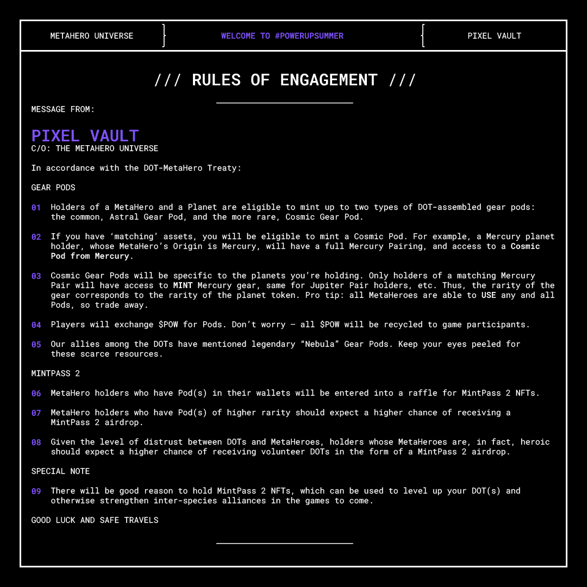

# POWer Up Summer


**POWer Up Summer ended on 14 Sep 2022.** Originally, Pixel Vault planned to allow multiple Gear Pod mints, with multiple sets of Nebula Gear Pod and MintPass 2 raffles. However, due to delays from organising the [make-up mint](POWerUpSummer.md#gear-pod-mint-1-make-up-mint), and a lack of clarity around what Gear Pods are for, POWer Up Summer ended after one set of raffles.


**On this page, you'll find:**

* [context](POWerUpSummer.md#context) behind POWer Up Summer
* [details](POWerUpSummer.md#gamification) of the game mechanics
* a [timeline](POWerUpSummer.md#timeline) of events so far, to help you make sense of what's going on
* useful [resources](POWerUpSummer.md#undefined)

## Context

Holders of [MetaHero Identities](../learn/ecosystem/MHU/identities.md) had the option to stake for [$POW](../learn/ecosystem/MHU/POW.md) over a 6-month period which ended on June 5, 2022. After this staking period ended, Pixel Vault launched **POWer Up Summer** to continue gamifying the experience of being a MetaHero Identity holder and to allow holders to prepare their MetaHeroes for the many games to come.

In the context of the MetaHero Universe, POWer Up Summer is the beginning of a peace treaty between the MetaHeroes and [DOTs](../learn/ecosystem/MHU/DOTs.md), which gives MetaHeroes an opportunity to _"assemble a fleet of DOTs"_ to _"promote interplanetary co-operation, expansion and discovery"_.

This leads to the DOTs distributing [**Gear Pods**](../learn/ecosystem/MHU/gear-pods.md) to MetaHeroes:


**What is a Gear Pod?**

Gear Pods are "critical supplies" that the DOTs are deploying to MetaHeroes to help them power up and explore the MetaHero Universe. The contents (gear) of the Gear Pods will be revealed when the Gear Pods are burned in-game. The rarity of the gear will vary with the different pods. There are 3 different types of pods:

* **Astral Gear Pod** - most common
* **Cosmic Gear Pod** - rarer than Astral, with planet-specific variations. All MetaHeroes will be able to use any gear, regardless of their planet of origin.
* **Nebula Gear Pod** - extremely rare


## Gamification

There are **3** key elements to POWer Up Summer. Here's how it works:

### **1) Gear Pod minting**

Holders of at least 1 [MetaHero Identity](../learn/ecosystem/MHU/identities.md) **AND** at least 1 [Planet](../learn/ecosystem/MHU/planets.md) are eligible to mint Gear Pods:

**What you need to know:**&#x20;

* each MetaHero Identity can be paired with up to 3 separate planet tokens, allowing holders to mint up to 3 Gear Pods per MetaHero held. There are 3 possible combinations:
  * 1 MetaHero + 1 mismatching, non-origin Planet = Astral Gear Pod
  * 1 MetaHero + 1 matching, origin Planet = Cosmic Gear Pod (`{insert Planet}`)
  * 1 MetaHero + 1 Moon = Cosmic Gear Pod (Moon)
* each Gear Pod can be minted for 2000 [$POW](../learn/ecosystem/MHU/POW.md)


### **2) Nebula Gear Pod distribution & raffles**

Nebula Gear Pods can't be minted, instead:

* 1 Nebula Gear Pod will be given to collectors, **for each** of the following Pixel Vault assets they hold:
  * [MetaHero Core Identity](../learn/ecosystem/MHU/identities.md#core-metahero-identities)
  * [PUNKS Comic #1: Special Edition](../learn/gamification/punks/comic1.md#outcome)
  * [Planet DAO Set](../learn/gamification/sets.md)
* holders of at least 1 Astral **OR** 1 Cosmic Gear Pod are entered into raffles to win Nebula Gear Pods. Each Astral or Cosmic Gear Pod acts as 1 ticket into the raffle. The total number of Nebula Gear Pods raffled out will be 2% of the total Astral Gear Pod supply + 5% of the total Cosmic Gear Pod supply

### **3) MintPass #2 raffles**

Holders of at least 1 [MetaHero Identity](../learn/ecosystem/MHU/identities.md) **AND** at least 1 Gear Pod (any of the 3 types) are eligible for raffles to win MintPass #2.

**What you need to know:**&#x20;

* for the raffle, each Gear Pod will provide different numbers of entries into the raffle (see below)
* holding at least 1 MetaHero Identity with type = Hero will 3x your number of entries&#x20;

<details>

<summary>Gear Pod raffle entries</summary>

* Astral Gear Pod: 1
* Cosmic Gear Pod (Jupiter): 2
* Cosmic Gear Pod (Saturn): 2
* Cosmic Gear Pod (Neptune): 2
* Cosmic Gear Pod (Uranus): 2
* Cosmic Gear Pod (Pluto): 3
* Cosmic Gear Pod (Mars): 4
* Cosmic Gear Pod (Venus): 5
* Cosmic Gear Pod (Earth): 5
* Cosmic Gear Pod (Mercury): 6
* Cosmic Gear Pod (Moon): 7
* Nebula Gear Pod: 7

</details>


**Note for Collectors:**

* Whether you can mint Gear Pods, and which ones you can mint, is determined based on snapshots of wallet holdings at particular times**.** There are **multiple** Gear Pod mints which means **multiple** snapshots will be taken throughout POWer Up Summer.
* Staked MetaHeroes were captured for the 1st snapshot & Gear Pod mint window. They need to be unstaked by 6/30/22 at 11:59 pm EST to qualify for future Gear Pod mints and the MintPass 2 raffle.


## Timeline

Here's everything you need to know about POWer Up Summer:

### DOT-MetaHero Peace Treaty

POWer Up Summer began with a transmission from the DOTs _(transcript below)_



<details>

<summary>Transcript</summary>

```
*INCOMING INTERPLANETARY COMMUNICATION*

SENDER: THE INGENIOUS AND POWERFUL DOTS
MESSAGE ORIGIN: MOON
FOR: METAHERO REPRESENTATIVE, ON BEHALF OF EARTH
SUBJECT: TREATY OF PEACE WITH THE TOLERABLE METAHEROES

*TRANSMISSION START*

THE CONTRACTING PARTIES, In order to
promote interplanetary co-operation,
expansion and discovery, and to
achieve interplanetary peace and
security, Agree to this Covenant.

THE DOTS HEREBY PLEDGE

1. Cessation of hostilities immediately
upon signing; satelities and other
orbital weapons systems to be placed
on standby; resume provisional access to
critical infrastructure.

2. AID AND SUPPORT of INTERPLANETARY 
DOT VOLUNTEERS for impacted METAHEROES as
"REPARATIONS" for lives lost during the
"MISUNDERSTANDING".

3. Return of critical supplies to METAHEROES
for interplanetary exploration. Pending
shipping costs.

THE METAHEROES HEREBY PLEDGE

1. Immediate establishment of free and continued
passage for all DOTs to and from the MOON.

2. The establishment of a free market of POW
between METAHEROES and DOTs

In the event of the BARELY, SCARCELY TOLERABLE
METAHEROES not fulfilling these obligations, DOTs
reserve all rights to ~oblit~ ~annih~ take mili

*TRANSMISSION TERMINATED*    
```

</details>

### Rules of Engagement

This was followed by the release of the Rules of Engagement, which introduced the concept of **Gear Pods** and teased the mechanics [MintPass #2](../learn/ecosystem/MHU/mintpass/2.md) raffles.



### Gear Pod Mint #1

The 1st Gear Pod mint window was open for 72 hours, based on a snapshot taken on June 15, 2022 at 12:00 pm EST ([block 14968339](https://etherscan.io/block/14968339))



### Gear Pod Mint #1 (Make-Up Mint)

A make-up mint was opened on 27 July 2022 for collectors who:

* had their Metahero Identities & Planets split across multiple wallets, and filled out a [form](https://twitter.com/Gfunkera86/status/1538195430219124736) for Pixel Vault to manually determine eligibility; or
* were unable to mint during the [original mint window](POWerUpSummer.md#gear-pod-mint-1) due to travels, given it clashed with NFT NYC



### Nebula Gear Pod Airdrop

897 Nebula Gear Pods were distributed via an airdrop on 4 Aug 2022. Details of how these were distributed are [here](POWerUpSummer.md#2-nebula-gear-pod-distribution-and-raffles).



### MintPass 2 Airdrop

2,000 MintPass 2's were distributed via an airdrop on 14 September 2022. This airdrop marked the **end of POWep UP Summer.**



## Resources


